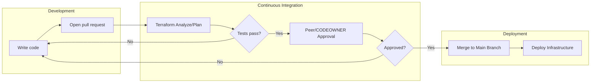
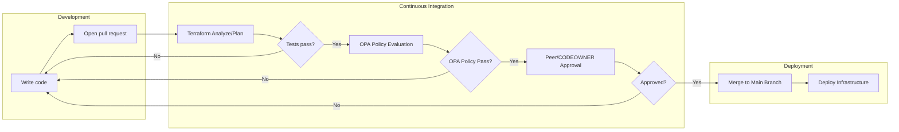

# Build Safe by Default: Cloud Risk Controls with Infrastructure-as-Code + Open Policy Agent

Implementing “safe by default” cloud deployments require strong, automated controls. This session shows how Infrastructure‑as‑Code and Open Policy Agent reduce cloud configuration risk by enforcing policies early and continuously, minimizing human error, and strengthening risk‑based decision making.
---

## Table of Contents

- [How It Works](#how-it-works)
- [Repository Structure](#repository-structure)
- [Demo Setup Guide](#demo-setup-guide)
  - [Prerequisites](#prerequisites)
  - [1. Azure Setup](#1-azure-setup)
  - [2. GitHub Setup](#2-github-setup)
  - [3. Running the Demo](#3-running-the-demo)
- [Audit Notes](#audit-notes)

---

## How It Works

### IaC alone — the baseline



Terraform gives you repeatable, auditable infrastructure — but nothing stops a developer from writing a misconfigured resource. A reviewer may miss it, or approve under time pressure. The risk lands in production.

### IaC + OPA — safe by default



Adding OPA (`conftest`) as a required CI check closes the gap. Policy violations are caught **before** Terraform contacts Azure and **before** any human review — non-compliant code cannot merge regardless of reviewer action.

The policy in [demo/policy/enforce_storage_grs.rego](demo/policy/enforce_storage_grs.rego) blocks any `azurerm_storage_account` that does not set `account_replication_type = "GRS"`, enforcing geo-redundancy as a non-negotiable baseline.

---

## Repository Structure

```
.github/
  workflows/
    pr-open-main.yaml     # Runs on PR open: OPA check + terraform plan
    pr-merge-main.yaml    # Runs on merge to main: terraform apply
demo/
  policy/
    enforce_storage_grs.rego   # OPA/conftest policy (deny non-GRS storage)
  terraform/
    backend.tf            # Azurerm backend (config injected at runtime)
    provider.tf           # Azurerm provider (subscription via env var)
    example.tf            # Demo resource definitions
examples/
  code snippets/
    presentation_rego.rego      # Slide-ready Rego snippet
    presentation_terraform.tf   # Slide-ready Terraform snippet
```

---

## Demo Setup Guide

Follow these steps to replicate the demo environment in your own Azure subscription and GitHub repository.

### Prerequisites

- An **Azure subscription** where you have Owner or Contributor + User Access Administrator rights
  > **Don't have a subscription?** Sign up for a free Azure trial at [azure.microsoft.com/free](https://azure.microsoft.com/free) — includes $200 credit for 30 days and a set of always-free services. You will need a Microsoft account and a credit card for identity verification (you are not charged until you explicitly upgrade).
- A **GitHub account** with your own fork or copy of this repository
- [Azure CLI](https://learn.microsoft.com/en-us/cli/azure/install-azure-cli) installed locally (for the setup steps below)

---

### 1. Azure Setup

#### 1.1 Create a Microsoft Entra App Registration for OIDC

The GitHub Actions workflows authenticate to Azure using **OpenID Connect (OIDC) — no stored passwords or long-lived secrets**.

1. In the [Azure Portal](https://portal.azure.com), navigate to **Microsoft Entra ID → App registrations → New registration**.
2. Give it a name (e.g. `gh-iac-demo`) and register it.
3. Note the **Application (client) ID** and **Directory (tenant) ID** — you will need these later.
4. Under **Certificates & secrets → Federated credentials → Add credential**, configure a GitHub Actions federated identity:
   - **Federated credential scenario**: GitHub Actions deploying Azure resources
   - **Organization**: your GitHub org or username
   - **Repository**: the name of this repo
   - **Entity type**: `Environment`
   - **GitHub environment name**: `main`

> **Microsoft documentation**: [Configure an app to trust a GitHub Actions workflow](https://learn.microsoft.com/en-us/entra/workload-id/workload-identity-federation-create-trust?pivots=identity-wif-apps-methods-azp#github-actions)

#### 1.2 Assign RBAC Roles

The App Registration's service principal needs permissions to deploy resources and read/write Terraform state.

```bash
# Replace with your values
APP_ID="<Application (client) ID>"
SUBSCRIPTION_ID="<your subscription ID>"
STATE_RG="<resource group containing the state storage account>"

# Contributor on the subscription (for resource deployments)
az role assignment create \
  --assignee "$APP_ID" \
  --role "Contributor" \
  --scope "/subscriptions/$SUBSCRIPTION_ID"

# Storage Blob Data Contributor on the state storage account's resource group
az role assignment create \
  --assignee "$APP_ID" \
  --role "Storage Blob Data Contributor" \
  --scope "/subscriptions/$SUBSCRIPTION_ID/resourceGroups/$STATE_RG"
```

> **Microsoft documentation**: [Assign Azure roles using the Azure CLI](https://learn.microsoft.com/en-us/azure/role-based-access-control/role-assignments-cli)

#### 1.3 Create a Storage Account for Terraform State

Terraform state is stored remotely in Azure Blob Storage. Create a dedicated storage account and container:

```bash
STATE_RG="rg-tf-state"
STATE_SA="stterraformstate$RANDOM"   # must be globally unique, 3–24 lowercase alphanumeric
STATE_CONTAINER="tfstate"
LOCATION="eastus"

az group create --name "$STATE_RG" --location "$LOCATION"

az storage account create \
  --name "$STATE_SA" \
  --resource-group "$STATE_RG" \
  --location "$LOCATION" \
  --sku Standard_GRS \
  --allow-blob-public-access false \
  --min-tls-version TLS1_2

az storage container create \
  --name "$STATE_CONTAINER" \
  --account-name "$STATE_SA" \
  --auth-mode login
```

Note the storage account name — you will need it for the GitHub variable `AZURE_TF_STATE_STORAGE_ACCOUNT_NAME`.

> **Microsoft documentation**: [Store Terraform state in Azure Storage](https://learn.microsoft.com/en-us/azure/developer/terraform/store-state-in-azure-storage)

---

### 2. GitHub Setup

#### 2.1 Create a Repository Environment

The workflows reference an environment named **`main`**. All variables and secrets must be set on this environment.

1. Go to your repository → **Settings → Environments → New environment**.
2. Name it **`main`**.
3. Optionally add **required reviewers** or **branch protection rules** (e.g. restrict deployments to the `main` branch only).

> **GitHub documentation**: [Managing environments for deployment](https://docs.github.com/en/actions/administering-github-actions/managing-environments-for-deployment)

#### 2.2 Configure Environment Variables

In **Settings → Environments → main → Environment variables**, add:

| Variable name | Description | Example value |
|---|---|---|
| `ARM_TENANT_ID` | Microsoft Entra tenant (directory) ID | `xxxxxxxx-xxxx-xxxx-xxxx-xxxxxxxxxxxx` |
| `AZURE_STORAGE_SUBSCRIPTION_ID` | Azure subscription ID where resources are deployed | `xxxxxxxx-xxxx-xxxx-xxxx-xxxxxxxxxxxx` |
| `AZURE_TF_STATE_STORAGE_ACCOUNT_NAME` | Name of the storage account holding Terraform state | `stterraformstate12345` |
| `AZURE_STORAGE_CONTAINER_NAME` | Name of the blob container for Terraform state | `tfstate` |

#### 2.3 Configure Environment Secrets

In **Settings → Environments → main → Environment secrets**, add:

| Secret name | Description |
|---|---|
| `ARM_CLIENT_ID` | Application (client) ID of the App Registration created in step 1.1 |

> **GitHub documentation**: [Using secrets in GitHub Actions](https://docs.github.com/en/actions/security-for-github-actions/security-guides/using-secrets-in-github-actions)

#### 2.4 Configure Branch Protection on `main`

Enforce the policy gate by requiring the PR workflow checks to pass before any merge.

1. Go to **Settings → Branches → Add branch ruleset** (or classic branch protection rule).
2. Target the **`main`** branch.
3. Enable **Require a pull request before merging**.
4. Enable **Require status checks to pass** and add the following required check (this is the job name, not individual steps):
   - `Generate Plans`
5. Enable **Do not allow bypassing the above settings** so admins cannot push directly.

> **GitHub documentation**: [About protected branches](https://docs.github.com/en/repositories/configuring-branches-and-merges-in-your-repository/managing-protected-branches/about-protected-branches)

---

### 3. Running the Demo

#### Scenario A — Policy blocks a non-compliant change (the "deny" path)

1. Create a feature branch.
2. In `demo/terraform/example.tf`, uncomment the `azurerm_storage_account` block. It uses `account_replication_type = "LRS"`.
3. Open a pull request targeting `main`.
4. Watch the **"Analyze & Plan Terraform"** workflow fail at the **OPA Policy Terraform Check** step with:
   ```
   [STORAGE GRS - DENY] Storage account "stexample" ... must use account_replication_type = "GRS" (got "LRS").
   ```
5. The PR cannot be merged because the required check fails — **the policy works**.

#### Scenario B — Compliant change is deployed (the "allow" path)

1. Change `account_replication_type` to `"GRS"` in the storage account block.
2. Push to the same branch and observe the workflow pass all checks.
3. Merge the PR — the **"Apply Terraform Plans"** workflow runs `terraform apply` automatically.
